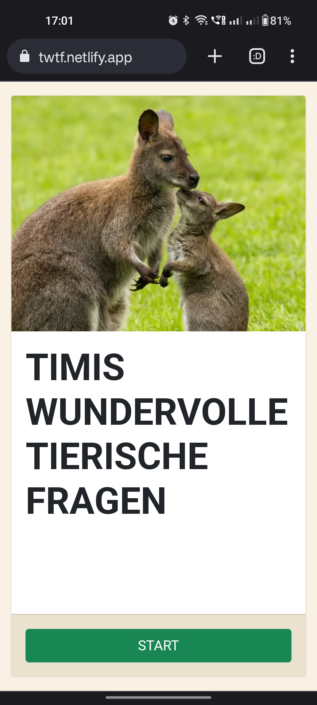
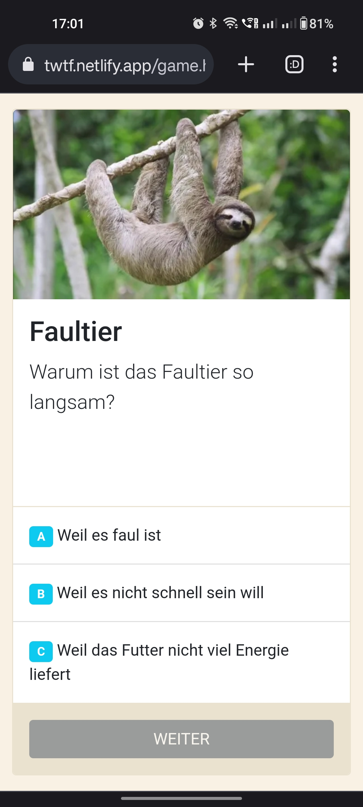
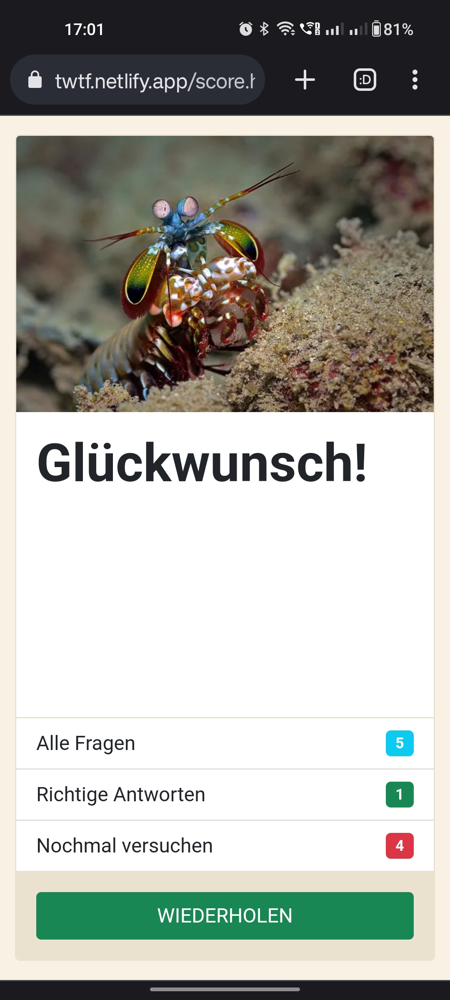

# Timis wundervolle tierische Fragen

"Timis wundervolle tierische Fragen" is a quiz game created together with my
son Tim. You get the best experience by playing the game on a mobile device.

Play online: <https://twtf.netlify.app/>.

## License

Copyright (c) 2022-23 Alexander and Tim Sulim

"Timis wundervolle tierische Fragen" is free software: you can redistribute it
and/or modify it under the terms of the GNU General Public License as published
by the Free Software Foundation, either version 3 of the License, or (at your
option) any later version.

See [COPYING](COPYING) for license text.
